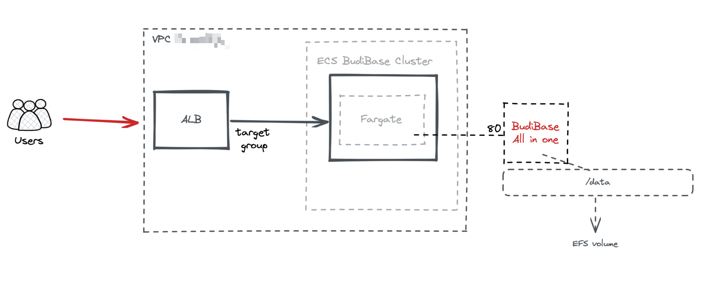

[](https://badge.fury.io/js/cdk-budibase)
[](https://badge.fury.io/py/cdk-budibase)


# Welcome to `cdk-budibase`
> [`BudiBase`](https://github.com/Budibase/budibase)  is open source! is Build apps, forms, and workflows that perfectly fit your business - so you can move forward, faster. Best of all.
> Use AWS CDK to create budibase server.
> data store in efs


- base resource:
  - vpc, ecs cluster, ecs service, efs


> ref: https://medium.com/devops-techable/learn-how-to-use-the-efs-mount-point-in-your-ecs-cluster-running-fargate-with-aws-cdk-e5c9df435c8b


### Architecture


### Deploy cdk-budibase via example [code](./src/integ.api.ts).

```bash
# example cdk app diff.
npx aws-cdk@latest diff --app='npx ts-node src/integ.api.ts'

# example cdk app deploy.
npx aws-cdk@latest deploy --app='npx ts-node src/integ.api.ts'

# example cdk app destroy (in case you miss remove efs, you need to remove efs, and log group manually on aws console or via aws cli, sdk etc...).
npx aws-cdk@latest destroy --app='npx ts-node src/integ.api.ts'
```


### EFS


### BudiBase


